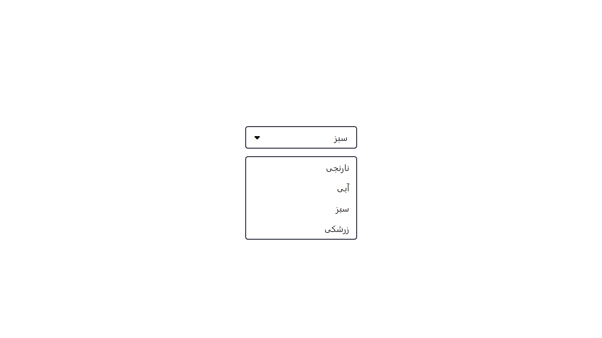

### سلام به همه :)
امروز برای یکی از پروژه هام یک کد جاوااسکریپت نوشتم و گفتم شاید بدرد کسی بخوره، برای همین توی گیتهاب گذاشتم :)



## چطور دراپ داون بسازیم؟

در مرحله اول باید کتابخونه رو به پروژه اضافه کنید.
کافیه فایل **Dropdown.js** رو از اینجا دانلود کنید، توی پوشه پروژه تون بذارید و با تگ اسکریپت به صفحه تون متصلش کنید

```
<script src="./Dropdown.js"></script>
```

حالا کد دراپ داون رو هر جای صفحه که دوست داشتید اضافه کنید و متن هاش رو طبق نیازتون تغییر بدید، میتونید هر تعداد که بخواید آپشن قرار بدید و با **css** شخصی سازیش کنید :)

```
      <div class="select">
            <div class="front activator" id="activator">
                  <p class="text" id="drop-data">Drop Down</p>
                  <i class="fa-solid fa-caret-down"></i>
            </div>
            <div class="options" id="options">
                  <div class="option">
                        <p>option 1</p>
                  </div>
                  <div class="option">
                        <p>option 2</p>
                  </div>
                  <div class="option">
                        <p>option 3</p>
                  </div>
                  <div class="option">
                        <p>option 4</p>
                  </div>
            </div>
      </div>
```

## **موفق باشید! :)**